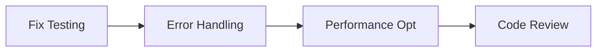
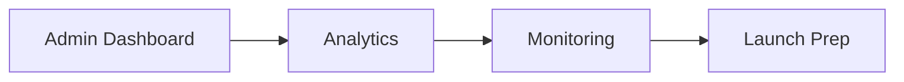

# EthosPrompt Project Analysis

## Executive Summary

EthosPrompt is a well-architected React-based AI prompt marketplace with a solid foundation but several areas requiring attention for production readiness and scalability. The project demonstrates good architectural decisions and modern development practices, though it suffers from testing infrastructure issues and lacks comprehensive error handling.

## 1. Current State Assessment

### 1.1 Architecture Overview and Technical Stack

**Strengths:**
- **Modern React Stack**: React 18.3.1 with TypeScript, Vite build system
- **Component Architecture**: Well-structured component hierarchy with clear separation of concerns
- **Styling System**: Comprehensive Tailwind CSS setup with custom design tokens
- **State Management**: Appropriate use of React hooks and context for theme management
- **Routing**: Clean React Router implementation with nested routes

**Technical Stack Evaluation:**
```
✅ React 18.3.1 (Latest stable)
✅ TypeScript 5.8.3 (Strong typing)
✅ Vite 5.0.12 (Fast build tool)
✅ Tailwind CSS 3.4.1 (Modern styling)
✅ Radix UI (Accessible components)
⚠️ Emotion (Additional complexity)
```

### 1.2 Code Quality and Structure

**Positive Aspects:**
- **TypeScript Integration**: Strict TypeScript configuration with proper type definitions
- **Component Organization**: Logical folder structure with feature-based organization
- **Code Standards**: ESLint and Prettier configuration for consistent formatting
- **Import Aliases**: Clean path aliases for better import management

**Areas of Concern:**
- **Mixed Styling Approaches**: Both Tailwind and Emotion CSS-in-JS
- **Large Component Files**: Some components could benefit from decomposition
- **Inconsistent Error Handling**: Basic try-catch blocks without comprehensive error boundaries

### 1.3 Feature Completeness Review

**Implemented Features:**
- ✅ Prompt browsing and categorization (12 categories, 1000+ prompts)
- ✅ Hierarchical data structure (Categories → Subcategories → Prompt Groups → Prompts)
- ✅ Difficulty-based filtering system
- ✅ Copy-to-clipboard functionality
- ✅ Responsive design with mobile support
- ✅ Dark theme implementation
- ✅ Static site deployment via GitHub Pages

**Missing Critical Features:**
- ❌ User authentication and accounts
- ❌ Payment processing integration
- ❌ Search functionality
- ❌ User favorites/bookmarks
- ❌ Prompt rating and review system
- ❌ Admin dashboard for content management
- ❌ Analytics and tracking

### 1.4 Performance and Optimization Status

**Current Optimizations:**
- ✅ Vite build optimization with code splitting
- ✅ Manual chunk configuration for vendor libraries
- ✅ Bundle analysis tools (rollup-plugin-visualizer)
- ✅ ESNext target for modern browsers
- ✅ Framer Motion for smooth animations

**Performance Gaps:**
- ❌ No lazy loading for routes or components
- ❌ No image optimization
- ❌ No service worker for caching
- ❌ Large data files loaded synchronously
- ❌ No virtual scrolling for large lists

### 1.5 Testing Coverage Assessment

**Critical Issues:**
- 🔴 **Testing Infrastructure Broken**: Multiple conflicting Vitest configurations
- 🔴 **No Real Component Tests**: Only basic smoke tests exist
- 🔴 **No Integration Tests**: Missing user flow testing
- 🔴 **No E2E Tests**: No end-to-end testing strategy

**Current Test Files:**
```
- 20+ Vitest configuration files (indicates configuration struggles)
- Basic smoke tests (1 + 1 = 2)
- Minimal React component tests
- No business logic testing
- No data layer testing
```

### 1.6 Documentation Quality Review

**Existing Documentation:**
- ✅ Comprehensive README with business focus
- ✅ Detailed prompt structure documentation
- ✅ Contributing guidelines
- ✅ Security policy
- ✅ Component documentation (DataTable)

**Documentation Gaps:**
- ❌ API documentation (when implemented)
- ❌ Deployment guide
- ❌ Development setup instructions
- ❌ Architecture decision records
- ❌ Performance optimization guide

## 2. Identified Strengths

### 2.1 Well-Implemented Features

**Data Architecture:**
- Sophisticated 4-level hierarchy (Categories → Subcategories → Prompt Groups → Prompts)
- Type-safe data models with proper TypeScript interfaces
- Difficulty-based prompt classification system
- Comprehensive prompt metadata (tags, prerequisites, estimated time)

**UI/UX Design:**
- Professional dark theme with purple/pink gradient accents
- Responsive design with mobile-first approach
- Accessible components using Radix UI primitives
- Smooth animations with Framer Motion

**Development Experience:**
- Fast development server with Vite
- Hot module replacement for rapid iteration
- Comprehensive linting and formatting setup
- Clear project structure and naming conventions

### 2.2 Good Architectural Decisions

**Component Design:**
- Reusable UI component library with variants
- Proper separation of concerns (data, UI, business logic)
- Context-based theme management
- Composable component patterns

**Build System:**
- Modern Vite configuration with optimization
- Code splitting and chunk optimization
- Bundle analysis integration
- Environment-based configuration

### 2.3 Quality Code Patterns

**TypeScript Usage:**
- Strict type checking enabled
- Proper interface definitions for all data models
- Generic components with type safety
- Path mapping for clean imports

**Styling Approach:**
- Consistent design system with Tailwind
- Custom color palette and spacing scale
- Component variants using class-variance-authority
- Responsive design patterns

## 3. Areas for Improvement

### 3.1 Critical Technical Debt

**Testing Infrastructure (Priority: CRITICAL)**
- Multiple broken Vitest configurations need consolidation
- Missing test setup for React components
- No testing strategy or guidelines
- Zero coverage of business logic

**Error Handling (Priority: HIGH)**
- No error boundaries for React components
- Basic try-catch blocks without user feedback
- No global error handling strategy
- Missing loading states and error messages

**Performance Issues (Priority: MEDIUM)**
- Large prompt data files loaded synchronously
- No code splitting for routes
- Missing image optimization
- No caching strategy

### 3.2 Missing Features

**Core Business Features:**
- User authentication system
- Payment processing (Stripe integration planned)
- Search and filtering capabilities
- User account management
- Prompt favorites and collections

**Content Management:**
- Admin dashboard for prompt management
- Content moderation tools
- Bulk import/export functionality
- Version control for prompts

**Analytics and Monitoring:**
- User behavior tracking
- Performance monitoring
- Error tracking (Sentry integration planned)
- Business metrics dashboard

### 3.3 UX/UI Enhancement Opportunities

**User Experience:**
- Advanced search with filters
- Prompt preview functionality
- Better mobile navigation
- Loading states and skeleton screens
- Toast notifications for user actions

**Accessibility:**
- Keyboard navigation improvements
- Screen reader optimization
- Color contrast validation
- Focus management

## 4. Recommended Next Steps

### 4.1 Priority-Ranked Action Items

**Phase 1: Foundation (Weeks 1-2)**
1. **Fix Testing Infrastructure** (Critical)
   - Consolidate Vitest configurations
   - Set up proper React Testing Library integration
   - Create testing guidelines and examples
   - Achieve 80%+ test coverage for core components

2. **Implement Error Boundaries** (High)
   - Add React error boundaries
   - Create global error handling
   - Implement user-friendly error messages
   - Add loading states throughout the app

3. **Performance Optimization** (Medium)
   - Implement route-based code splitting
   - Add lazy loading for components
   - Optimize data loading strategies
   - Add service worker for caching

**Phase 2: Core Features (Weeks 3-6)**
4. **Search Functionality** (High)
   - Implement client-side search
   - Add advanced filtering options
   - Create search result highlighting
   - Add search analytics

5. **User Authentication** (High)
   - Integrate authentication provider (Auth0/Firebase)
   - Create user account pages
   - Implement protected routes
   - Add user preferences

6. **Payment Integration** (Medium)
   - Integrate Stripe payment processing
   - Create pricing tiers
   - Implement purchase flow
   - Add receipt and billing management

**Phase 3: Enhancement (Weeks 7-12)**
7. **Content Management** (Medium)
   - Build admin dashboard
   - Create prompt management interface
   - Add content moderation tools
   - Implement bulk operations

8. **Analytics and Monitoring** (Medium)
   - Integrate Google Analytics
   - Add Sentry error tracking
   - Create performance monitoring
   - Build business metrics dashboard

### 4.2 Resource Requirements and Effort Estimates

**Development Team:**
- 1 Senior Frontend Developer (React/TypeScript)
- 1 Backend Developer (Node.js/API development)
- 1 UI/UX Designer (part-time)
- 1 DevOps Engineer (part-time)

**Estimated Effort:**
- Phase 1: 80-120 hours
- Phase 2: 200-300 hours  
- Phase 3: 300-400 hours
- **Total: 580-820 hours (3-5 months with full team)**

## 5. Implementation Roadmap

### 5.1 Development Phases

**Phase 1: Stabilization (Weeks 1-2)**


**Phase 2: Core Features (Weeks 3-6)**


**Phase 3: Scale & Polish (Weeks 7-12)**


### 5.2 Dependencies and Risk Assessment

**Critical Dependencies:**
- Testing infrastructure fix (blocks all other testing)
- Authentication system (required for payments)
- Payment processing (core business requirement)

**Risk Mitigation:**
- **Technical Risk**: Maintain backward compatibility during refactoring
- **Business Risk**: Implement feature flags for gradual rollout
- **Performance Risk**: Monitor bundle size and loading times
- **Security Risk**: Regular security audits and dependency updates

### 5.3 Success Metrics

**Technical Metrics:**
- Test coverage > 80%
- Build time < 30 seconds
- Page load time < 2 seconds
- Zero critical security vulnerabilities

**Business Metrics:**
- User registration rate
- Prompt purchase conversion
- User retention rate
- Customer satisfaction score

## 6. Technical Recommendations

### 6.1 Immediate Actions (Week 1)

**Testing Infrastructure Fix:**
```bash
# Remove conflicting configs
rm vitest.*.config.*
# Keep only: vitest.config.ts
# Consolidate setup in: vitest.setup.ts
```

**Error Boundary Implementation:**
```typescript
// Create: src/components/ErrorBoundary.tsx
// Add to: src/App.tsx wrapping main content
// Implement: Global error context
```

### 6.2 Architecture Improvements

**State Management Evolution:**
- Current: React Context for theme
- Recommended: Add Zustand for complex state
- Future: Consider Redux Toolkit for enterprise features

**Data Layer Enhancement:**
- Current: Static JSON files
- Recommended: API abstraction layer
- Future: GraphQL for complex queries

### 6.3 Security Considerations

**Current Security Posture:**
- ✅ No sensitive data exposure
- ✅ Static site deployment (reduced attack surface)
- ⚠️ No input validation
- ❌ No rate limiting
- ❌ No CSRF protection

**Security Roadmap:**
1. Input sanitization for search
2. Content Security Policy headers
3. Rate limiting for API calls
4. Authentication security audit
5. Regular dependency updates

## 7. Deployment and Infrastructure

### 7.1 Current Deployment

**GitHub Pages Setup:**
- ✅ Automated CI/CD pipeline
- ✅ Branch protection on main
- ✅ Build optimization
- ⚠️ No environment management
- ❌ No staging environment

### 7.2 Recommended Infrastructure

**Multi-Environment Setup:**
```
Development → Staging → Production
     ↓           ↓          ↓
   Localhost   Vercel    GitHub Pages
```

**Monitoring Stack:**
- **Error Tracking**: Sentry
- **Analytics**: Google Analytics 4
- **Performance**: Web Vitals
- **Uptime**: StatusPage

## 8. Business Considerations

### 8.1 Monetization Strategy

**Current Model**: Premium prompt marketplace
**Revenue Streams**:
- Individual prompt purchases ($19.99-$24.99)
- Subscription tiers (Basic $299, Pro $999, Enterprise custom)
- Custom prompt development services

### 8.2 Competitive Analysis

**Strengths vs Competitors**:
- Professional focus (vs consumer-oriented platforms)
- Industry-specific categorization
- Quality-assured content
- Enterprise-grade features planned

**Market Positioning**:
- Target: B2B customers and professionals
- Differentiator: Industry expertise and quality
- Value Proposition: ROI-focused AI adoption

## 9. Conclusion

EthosPrompt represents a solid foundation for a professional AI prompt marketplace. The codebase demonstrates good architectural decisions and modern development practices, but requires focused effort on testing infrastructure, error handling, and core business features to achieve production readiness.

**Key Success Factors:**
1. **Immediate**: Fix testing and error handling
2. **Short-term**: Implement search and authentication
3. **Medium-term**: Add payment processing and admin tools
4. **Long-term**: Scale with analytics and enterprise features

**Investment Recommendation**:
The project is well-positioned for success with an estimated 3-5 month development cycle to reach MVP status, requiring a focused team and approximately $150K-250K investment for full feature implementation.

---

*This analysis provides a comprehensive roadmap for transforming EthosPrompt from a well-designed prototype into a production-ready, scalable business platform.*
